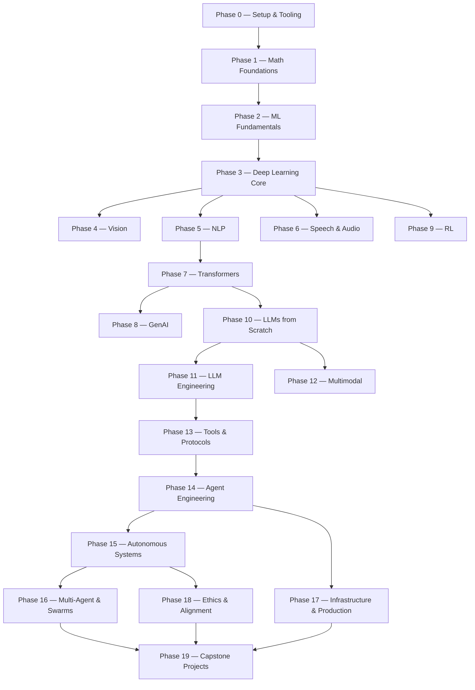
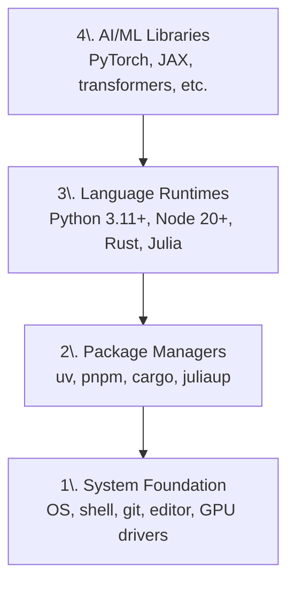
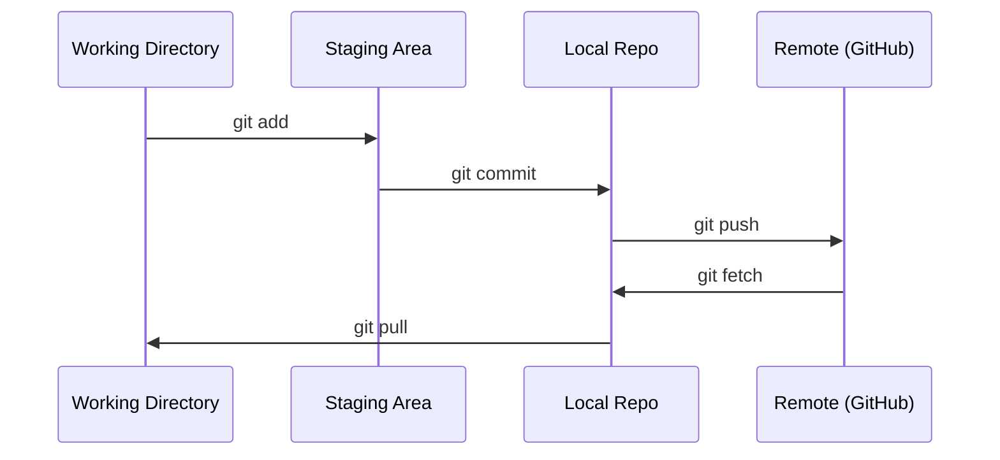
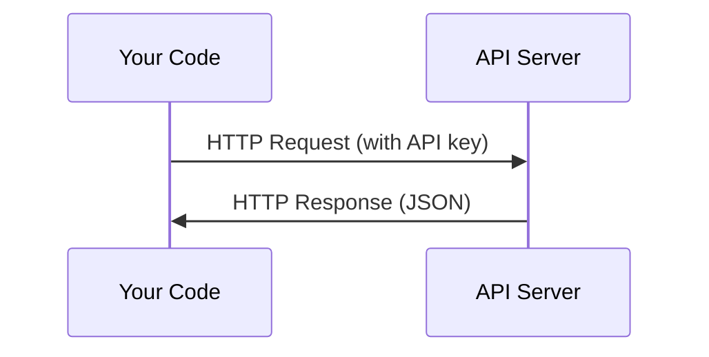
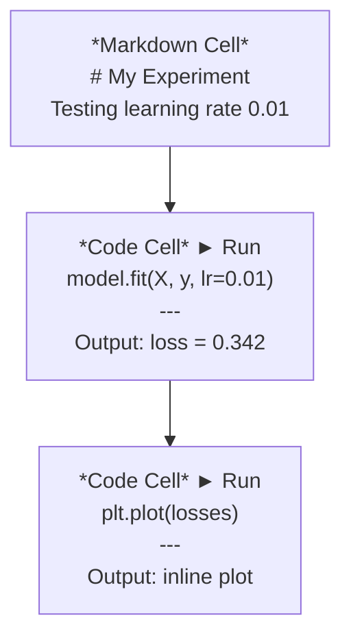
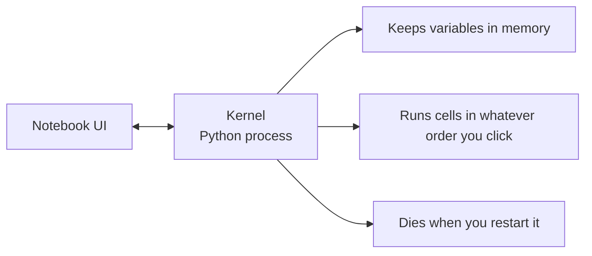
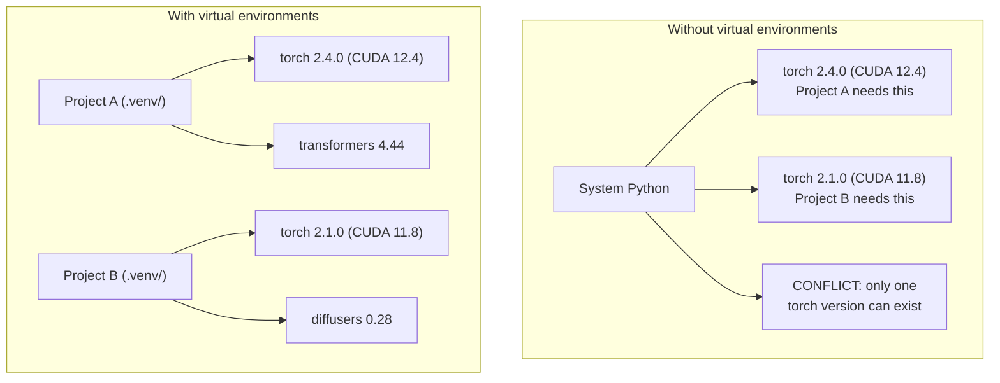
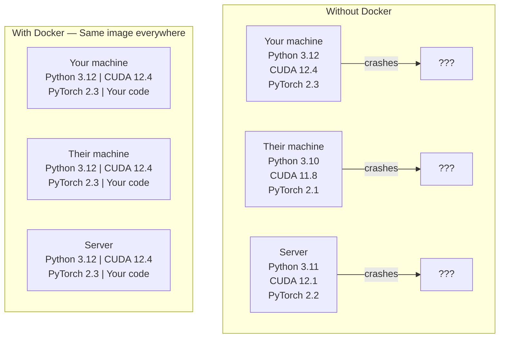
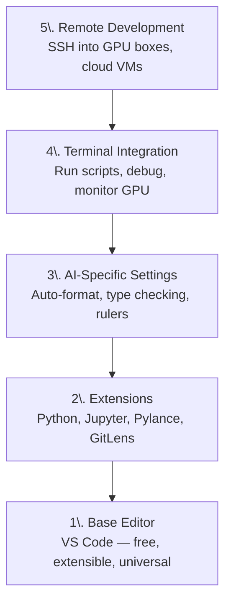
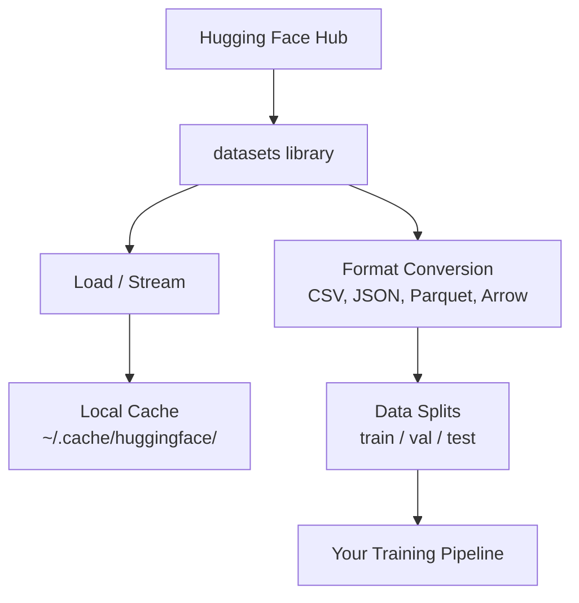

# 前言

[项目地址](https://github.com/rohitg00/ai-engineering-from-scratch)

涉及 20 phases, 503 lessons，4门语言：Python, TypeScript, Rust, Julia 。

每个 lesson 的流程固定：理解问题 → 数学推导 → 编码实现 → 运行测试 → 保存产物。

<!-- more -->



内置的智能体 skill ： 

- `/check-understanding <phase>` 每个 phase 的章节测试

| #   | 课程                    | 状态  | 预计用时    |
| --- | --------------------- | --- | ------- |
| 01  | Dev Environment       | ✅   | ~75 min |
| 02  | Git & Collaboration   | ✅   | ~45 min |
| 03  | GPU Setup & Cloud     | ✅   | ~75 min |
| 04  | APIs & Keys           | ✅   | ~75 min |
| 05  | Jupyter Notebooks     | ✅   | ~75 min |
| 06  | Python Environments   | ✅   | ~75 min |
| 07  | Docker for AI         | ✅   | ~75 min |
| 08  | Editor Setup          | ✅   | ~75 min |
| 09  | Data Management       | ✅   | ~75 min |
| 10  | Terminal & Shell      | ✅   | ~45 min |
| 11  | Linux for AI          | ✅   | ~45 min |
| 12  | Debugging & Profiling | ✅   | ~75 min |

# Dev Environment

## 学习目标

- 从零搭建 Python 3.11+、Node.js 20+ 和 Rust 工具链
- 配置虚拟环境和包管理器以实现可重现构建
- 验证 GPU 访问（CUDA/MPS）并运行测试张量运算
- 理解四层架构：系统层、包管理层、运行时层、AI 库层

## 概念

AI 工程环境有四层。我们自底而上进行安装，上层依赖下层。



## Build It

### Python with uv

用 uv 管理 Python： 

```zsh
sudo pacman -S uv

uv python install 3.12
uv python pin 3.12

uv venv
source .venv/bin/activate

uv pip install numpy matplotlib jupyter
```

### Node.js with pnpm

TypeScript 用于智能体、MCP 服务器、网页 APP 开发。

```zsh
# 安装pnpm
sudo pacman -S pnpm

# 添加到PATH中
pnpm setup

# Node v26.2.0
node -e "console.log('Node', process.version)"
```

### Rust

Rust 用于性能要求高的课程，比如接口、系统。

```zsh
sudo pacman -S rust

# rustc 1.96.0 (ac68faa20 2026-05-25) (Arch Linux rust 1:1.96.0-1)
rustc --version
# cargo 1.96.0 (30a34c682 2026-05-25) (Arch Linux rust 1:1.96.0-1)
cargo --version
```

### Julia (可选)

Julia 的亮点在于应对数学繁重的课程。

```zsh
sudo pacman -S julia

# Julia 1.12.6
julia -e 'println("Julia ", VERSION)'
```

### GPU Setup (如果你有)

```zsh
# NVIDIA
nvidia-smi

# Install PyTorch with CUDA
uv pip install torch torchvision torchaudio --index-url https://download.pytorch.org/whl/cu124
```

```python
import torch
print(f"CUDA available: {torch.cuda.is_available()}")
if torch.cuda.is_available():
    print(f"GPU: {torch.cuda.get_device_name(0)}")
```

大部分课程，CPU 就能胜任；如果非要用到 GPU，那么使用 Colab 或者云GPU 。

## Use It 

| 编程语言       | 用到的章节                                           | 包管理器  |
| ---------- | ----------------------------------------------- | ----- |
| Python     | Phases 1-12 (ML, DL, NLP, Vision, Audio, LLMs)  | uv    |
| TypeScript | Phases 13-17 (Tools, Agents, Swarms, Infra)     | pnpm  |
| Rust       | Phases 12, 15-17 (Performance-critical systems) | cargo |
| Julia      | Phase 1 (Math foundations)                      | Pkg   |

## Exercises

hello.py

```python
print('hello world')
```

hello.ts

```ts
console.log('hello world')
```

hello.rs

```rust
// rustc hello.rs
// ./hello
fn main() {
    println!("hello world");
}
```

hello.jl

```jl
# julia hello.jl
println("hello world")
```

# Git & Collaboration

## 学习目标

- 配置 Git 身份信息，并使用日常的 add、commit、push 工作流程；
- 创建并合并分支，以进行隔离 experiment 而不影响主分支；
- 编写 `.gitignore` 文件，排除模型 checkpoints 和大容量二进制文件；
- 使用 `git log` 浏览提交历史，理解项目的演进过程。

## 概念



添加 git 配置：

```zsh
git config --global user.name "pluinyiasnhg"
git config --global user.email "pluinyiasnhg@gmail.com"
```

git 日常工作流：

```zsh
git status
git add file.py
git commit -m "Add perceptron implementation"
git push origin main
```

git 分支：

```zsh
git checkout -b experiment/new-optimizer

# ... make changes, commit ...

git checkout main
git merge experiment/new-optimizer
```

推送分支到课程仓库：

```zsh
git clone https://github.com/rohitg00/ai-engineering-from-scratch.git
cd ai-engineering-from-scratch

git checkout -b my-progress
# work through lessons, commit your code
git push origin my-progress
```

## Use It

| Command                  | When                  |
| ------------------------ | --------------------- |
| `git clone`              | 下载课程仓库到本地             |
| `git add` + `git commit` | 保存工作                  |
| `git push`               | 上传到 Github            |
| `git checkout -b`        | 在不破坏 main 分支条件下，尝试新东西 |
| `git log --oneline`      | 看看目前做了哪些工作            |

## Exercises

练习1

```zsh
# 克隆仓库（这里我选择 fork 课程仓库）
git clone https://github.com/pluinyiasnhg/ai-engineering-from-scratch.git

# 创建并切换到分支 my-progress
git checkout -b my-progress

# 创建文件
touch Git.txt

# 提交并推送该文件
git add Git.txt
git commit -m "Add Git.txt"
git push origin my-progress

# 如果推送时，需要输入用户名和密码，则使用 SSH 方式推送
git remote set-url origin git@github.com:pluinyiasnhg/ai-engineering-from-scratch.git
```

练习2 ：要求创建一个 `.gitignore` 文件，不过课程项目下的 `.gitignore` 文件，已经满足了练习的要求。这里截取练习要求的部分：

```txt
# 模型权重文件
*.pt
*.pth
*.safetensors
```

练习3 ：运行 `git log --oneline` ，查看结果。

```zsh
cf52634 (HEAD -> my-progress) Add Git.txt
b963cf6 (grafted, origin/main, origin/HEAD, main) fix(site): About page dark mode + header overlap (#275)
```

# GPU Setup & Cloud

## 学习目标

- 使用 nvidia-smi 和 PyTorch 的 CUDA API ，验证本地 GPU 可用性
- 配置 Google Colab 使用 T4 GPU 进行免费云端实验
- 对 CPU 与 GPU 上的矩阵乘法进行基准测试并测量加速比 (speedup)
- 使用 fp16 经验法则，估算适合你显存的最大模型

## Build It

三种选择：

- 本地 NVIDIA GPU
- Google Colab
- Cloud GPU (Lambda, RunPod, Vast.ai)

> 本地 GPU 设置，已经在 [[#GPU Setup (如果你有)]] 提到；至于 Cloud GPU ，用 SSH 连接上远程服务器后，后续操作同本地GPU 。

Google Colab 的使用：

1. 打开 https://colab.research.google.com
2. 选择 Runtime > Change runtime type > T4 GPU，运行环境默认是 CPU 
3. 执行 `!nvidia-smi` ，验证运行环境是否是 GPU
4. 直接上传课程的 notebooks 到 Colab 


可以看到 Colab 免费提供的 T4 GPU 足足有 16G 显存。

## Exerceises

练习1 ：运行 `en.md` 中的 benchmark 代码，比较 CPU vs GPU 的用时。

```python
import torch
import time

size = 5000

a_cpu = torch.randn(size, size)
b_cpu = torch.randn(size, size)

start = time.time()
c_cpu = a_cpu @ b_cpu
cpu_time = time.time() - start
print(f"CPU: {cpu_time:.3f}s")

if torch.cuda.is_available():
    a_gpu = a_cpu.to("cuda")
    b_gpu = b_cpu.to("cuda")

    torch.cuda.synchronize()
    start = time.time()
    c_gpu = a_gpu @ b_gpu
    torch.cuda.synchronize()
    gpu_time = time.time() - start
    print(f"GPU: {gpu_time:.3f}s")
    print(f"Speedup: {cpu_time / gpu_time:.0f}x")
```

练习3 ：运行 `code/gpu_check.py`，检查你的GPU内存大小，并估算 GPU 能容纳的最大模型（经验之谈：fp16下每个参数占用2字节）。

 GPU内存，也称为 VRAM，即 Video RAM on the GPU 。此前，我一直以为 VRAM 是虚拟内存😂。

# APIs & Keys 

## 学习目标

- 使用环境变量和 `.env` 文件安全存储 API 密钥
- 使用 Anthropic Python SDK 和原始 HTTP 进行 LLM API 调用
- 比较基于 SDK 和原始 HTTP 的请求/响应格式以进行调试
- 识别并处理常见 API 错误，包括身份验证和速率限制

## 概念




## Build It

### 安全保存 API key

将 API key 保存到环境变量：

```zsh
export ANTHROPIC_API_KEY="sk-ant-..."
export OPENAI_API_KEY="sk-..."
```

或者使用 `.env` 文件保存。注意，将该文件添加到 `.gitignore` ，避免将 API key 推送到 Github 仓库中。

```txt
ANTHROPIC_API_KEY=sk-ant-...
OPENAI_API_KEY=sk-...
```

我没有 Anthropic 和 OpenAI 的官方 API key，找了中转 API key 作为替代。

###  首次调用 API (Python)

```python
import anthropic
from dotenv import load_dotenv

# 加载 .env 中的环境变量，比如 ANTHROPIC_API_KEY
load_dotenv()

client = anthropic.Anthropic(base_url='https://yunwu.ai')

response = client.messages.create(
    model="claude-sonnet-4-20250514",
    max_tokens=256,
    messages=[{"role": "user", "content": "What is a neural network in one sentence?"}]
)

print(response.content[0].text)
```

Response ：

```txt
A neural network is a computational model inspired by the human brain that processes data through interconnected layers of nodes to recognize patterns and make decisions.
```

### Raw HTTP (no SDK)

```python
import os
import urllib.request
import json
from dotenv import load_dotenv

load_dotenv()

# url = "https://api.anthropic.com/v1/messages"
url = "https://yunwu.ai/v1/messages"

headers = {
    "Content-Type": "application/json",
    "x-api-key": os.environ["ANTHROPIC_API_KEY"],
    "anthropic-version": "2023-06-01",
}
body = json.dumps({
    "model": "claude-sonnet-4-20250514",
    "max_tokens": 256,
    "messages": [{"role": "user", "content": "What is a neural network in one sentence?"}],
}).encode()

req = urllib.request.Request(url, data=body, headers=headers, method="POST")
with urllib.request.urlopen(req) as resp:
    result = json.loads(resp.read())
    print(result["content"][0]["text"])
```

Response:

```txt
A neural network is a computational model inspired by the human brain that uses layers of interconnected nodes to recognize patterns and learn from data.
```

# Jupyter Notebooks 

## 学习目标

- 安装并启动 JupyterLab、Jupyter Notebook 或带有 Jupyter 扩展的 VS Code
- 使用魔法命令（`%timeit`、`%%time`、`%matplotlib inline`）进行基准测试，并且内联显示可视化结果
- 区分何时使用 Notebook 与 Script，并遵循“在 Notebook 中探索，在 Script 中交付”的工作流
- 识别并避免常见的 Notebook 陷阱：乱序执行、隐藏状态和内存泄漏

## 概念

notebook 有许多单元格（cell），每个单元格要么是文本（Markdown Cell），要么是代码（Code Cell）。



Kernel 是一个在后台运行的 Python教程。每次运行单元格，notebook 会把单元格中的代码发送给 Kernel ，接着 Kernel 执行代码并将结果返回。

同一个 notebook 下的所有单元格，共享同一个 Kernel，因此各个变量也在单元格之间共享。



## Build It

### Pick your interface

| Interface        | Install                                      | Best for                                                   |
| ---------------- | -------------------------------------------- | ---------------------------------------------------------- |
| JupyterLab       | `pip install jupyterlab` <br>然后 `jupyter lab`    | Full IDE experience, multiple tabs, file browser, terminal |
| Jupyter Notebook | `pip install notebook` <br>然后 `jupyter notebook` | Simple, lightweight, one notebook at a time                |
| VS Code          | 安装 "Jupyter" 拓展                              | Already in your editor, git integration, debugging         |

这里我选择在当前项目下安装 JupyterLab 。

```zsh
uv pip install jupyterlab
```

### 键盘快捷键

**命令模式下最常用的:**

| Key            | Action          |
| -------------- | --------------- |
| `Shift+Enter`  | 运行单元格，并移动到下一单元格 |
| `A`            | 向上插入单元格         |
| `B`            | 向下插入单元格         |
| `DD`           | 删除单元格           |
| `M`            | 转换到 markdown 语法 |
| `Y`            | 转换到 code 语法     |
| `Z`            | 撤销单元格操作         |
| `Ctrl+Shift+H` | 展示所有快捷键         |

**编辑模式:**

| Key         | Action            |
| ----------- | ----------------- |
| `Tab`       | 自动补全              |
| `Shift+Tab` | 显示函数签名（signature） |
| `Ctrl+/`    | 切换注释              |

### Magic commands

魔法命令不是 Jupyter 特有的命令，和 Python 无关。魔法命令分为 line magic （以 `%` 开头）和 cell magic （以 `%%` 开头）。

以下是一些魔法命令。

`%timeit` 会多次运行代码并取平均值，而 `%%time` 只运行一次。微基准测试使用 `%timeit`，训练过程使用 `%%time`。

```jupyter
%timeit np.random.randn(10000)
```

```jupyter
%%time
model.fit(X_train, y_train, epochs=10)
```

**开启图片嵌入**后，`plt.plot()` 和 `plt.show()` 得到的图片可以直接在 notebook 中显示。

```jupyter
%matplotlib inline
```

无需离开 notebook 就能**安装 Python包**：

```jupyter
!pip install scikit-learn
```

这里的 `!` 前缀，会执行任一 shell 命令。

**查看环境变量**：

```jupyter
%env CUDA_VISIBLE_DEVICES
```

### Display rich output inline

notebook 自动展示单元格内的最后一个表达式返回的结果，包括 HMTL文本、图像等。

```python
import pandas as pd

df = pd.DataFrame({
    "model": ["Linear", "Random Forest", "Neural Net"],
    "accuracy": [0.72, 0.89, 0.94],
    "training_time": [0.1, 2.3, 45.6]
})

print(df)
print('-' * 50)
df
```

可以看到：`df` 的展示效果是一个格式化的HTML表格，而不是文本转储。


图片也是同理。


### Google Colab

Colab 是一个免费的云端 Jupter notebook 。

Colab 与本地 Jupyter 的区别：

- 文件不会在会话之间持久保存（需保存到云端硬盘或下载）
- 预装 Python 库：numpy、pandas、matplotlib、torch、tensorflow、sklearn
- 使用 `from google.colab import files` 上传/下载文件
- 使用 `from google.colab import drive; drive.mount('/content/drive')` 实现持久化存储
- 连续闲置 90 分钟后会话超时（免费版）

## Use It

**Notebook vs Script：何时使用哪种**

| 使用 notebook 的场景 | 使用 script 的场景 |
|----------------------|---------------------|
| 探索数据集 | 训练流水线 |
| 原型设计模型 | 可复用的工具函数 |
| 可视化结果 | 包含 `if __name__` 的代码 |
| 解释你的工作 | 按计划运行的代码 |
| 快速实验 | 生产环境代码 |
| 课程练习 | 包和库 |

**原则：在 notebook 中进行探索，在 script 中交付。**

**AI 中的常见工作流程：**

1. 在 notebook 中探索数据
2. 在 notebook 中构建模型原型
3. 模型运行正常后，将代码迁移到 `.py` 文件中
4. 将那些 `.py` 文件导入回 notebook，用于进一步的实验

> [!info] notebook 内存泄露风险
> 比如，加载一个4GB的数据集，训练一个模型，再加载另一个数据集。没有任何内存被释放。
> 解决方法：使用 `%who` 查看所有变量， `del variable_name` 释放变量，或者 `import gc; gc.collect()`，或者重启内核。

## Exercises

练习1 ：在 notebook 中，用列表表达式和 numpy 两种方式，分别创建一个包含十万随机数的数组。使用 `%timeit` 比较二者的执行效率。

```python
import numpy as np

print("=== Timing: List vs NumPy ===")

size = 100_000

print('List comprehension: ')
%timeit python_list = [x ** 2 for x in range(size)]
print('NumPy: ')
%timeit numpy_array = np.arange(size) ** 2
```

可以看到：列表表达式是毫秒级，Numpy 是微秒级。Numpy 的执行效率是列表表达式的 60 倍！

```txt
=== Timing: List vs NumPy ===
List comprehension: 
2.97 ms ± 8.31 μs per loop (mean ± std. dev. of 7 runs, 100 loops each)
NumPy: 
49.4 μs ± 318 ns per loop (mean ± std. dev. of 7 runs, 10,000 loops each)
```

# Python Environments

## 学习目标

- 使用 uv、venv 或 conda 创建隔离的虚拟环境
- 编写带有可选依赖组份（groups）的 pyproject.toml，并生成锁定文件以确保可复现性
- 诊断并修复常见陷阱：全局安装、pip 与 conda 混用、CUDA 版本不匹配
- 针对依赖冲突的项目，实施按照 phase 配置环境的策略（20个 phase 共用一个环境，很难不起冲突）

## 概念


## Build It

### uv venv (建议)

uv 管理项目：

```zsh
uv python install 3.12

# 创建虚拟环境
cd your-project
uv venv
source .venv/bin/activate

# 安装 Python 包
uv pip install torch numpy
```

uv 创建项目：

```zsh
uv init my-ai-project
cd my-ai-project
uv add torch numpy matplotlib
```

### venv (内置)

如果没法安装 uv，可以退而求其次，选择 Python 自带的虚拟环境管理工具 venv 。

```zsh
python3 -m venv .venv
source .venv/bin/activate 

pip install torch numpy
```

### conda (指明要用)

不建议用 conda 管理环境。

如果确实需要用到 conda，那么请注意：最好不用将 conda 和 pip 混用。如果某个包 conda 不能下载而 pip 可以，此时先安装 conda 能下载到的包，最后再用 pip 补上缺失的包。

```zsh
conda create -n myproject python=3.12
conda activate myproject

conda install pytorch torchvision torchaudio pytorch-cuda=12.4 -c pytorch -c nvidia
```

## pyproject.toml 基础

每一个 Python 项目都应该有一个 `pyproject.toml` 配置文件，一个 `pyproject.toml` 就足以代替 `setup.py` ， `setup.cfg` 和 `requirements.txt` 。

```toml
[project]
name = "ai-engineering-from-scratch"
version = "0.1.0"
requires-python = ">=3.11"
dependencies = [
    "numpy>=1.26",
    "matplotlib>=3.8",
    "jupyter>=1.0",
    "scikit-learn>=1.4",
]

[project.optional-dependencies]
torch = ["torch>=2.3", "torchvision>=0.18"]
llm = ["anthropic>=0.39", "openai>=1.50"]
```

然后开始安装：

```zsh
uv pip install -e ".[torch]"    # base + PyTorch
uv pip install -e ".[llm]"     # base + LLM SDKs
uv pip install -e ".[torch,llm]" # everything
```

## Lockfiles

Lockfile 列出每个包及其确切版本、确保跨机器安装一致的文件。只要有 Lockfile 在，任何人都能下载到准确无误的包，避免可能的依赖冲突。

```zsh
# uv generates uv.lock automatically when using uv add
uv add numpy

# pip-tools approach
uv pip compile pyproject.toml -o requirements.lock
uv pip install -r requirements.lock
```

# Docker for AI

## 学习目标

- 通过 Dockerfile 构建一个包含 CUDA、PyTorch 和 AI 库的、支持 GPU 的 Docker 镜像。
- 将宿主机的目录挂载为数据卷，以便在容器重建时持久化保存模型、数据集和代码。
- 配置 NVIDIA 容器工具包，以在容器内暴露 GPU。
- 使用 Docker Compose 编排多服务 AI 应用（推理服务器 + 向量数据库）。

## 概念

Docker 将你的代码、运行时、库和系统工具打包成一个称为容器（container）的隔离单元。

可以把它想象成一个轻量级的虚拟机，不同之处在于它共享宿主操作系统的内核，而不是运行自己的内核，因此它可以在几秒内启动，而不是几分钟。



| 术语                 | 含义                         |
| ------------------ | -------------------------- |
| **镜像（Image）**      | 一个只读模板。通过 Dockerfile 构建而成。 |
| **容器（Container）**  | 镜像的一个运行实例                  |
| **Dockerfile**     | 构建镜像的指令，一层一层堆叠。            |
| **卷（Volume）**      | 持久化存储，容器重启后数据依然保留。         |
| **docker-compose** | 一个工具，用于用 YAML 定义多容器应用程序。   |

## Build It

```zsh
# 安装 docker
sudo pacman -S docker

# 验证 docker
docker --version
```

### Understand base images

选择合适的 base image ，能够节约数小时的 debug 时间。

```txt
nvidia/cuda:12.4.1-devel-ubuntu22.04
  Full CUDA toolkit. Compilers included.
  Use for: building packages that need nvcc (flash-attn, bitsandbytes)
  Size: ~4 GB

nvidia/cuda:12.4.1-runtime-ubuntu22.04
  CUDA runtime only. No compilers.
  Use for: running pre-built code
  Size: ~1.5 GB

pytorch/pytorch:2.3.1-cuda12.4-cudnn9-runtime
  PyTorch pre-installed on top of CUDA.
  Use for: skipping the PyTorch install step
  Size: ~6 GB

python:3.12-slim
  No CUDA. CPU only.
  Use for: inference on CPU, lightweight tools
  Size: ~150 MB
```

### Write a Dockerfile for AI development

使用课程提供的 [Dockerfile](https://github.com/pluinyiasnhg/ai-engineering-from-scratch/blob/main/phases/00-setup-and-tooling/07-docker-for-ai/code/Dockerfile) 编译 `ai-dev` 镜像。编译过程中，有三处问题由 AI 发现并纠正。

| 问题               | 原因                           | 修复                    |
| :--------------- | :--------------------------- | :-------------------- |
| python3.12 找不到   | Ubuntu 22.04 默认无 Python 3.12 | 添加 ppa:deadsnakes/ppa |
| distutils 缺失     | 系统 pip 为 Python 3.10 构建      | 用 ensurepip 自举 pip    |
| torch==2.3.1 不存在 | PyTorch 已从 cu124 索引下架旧版      | 升级到 torch==2.4.0      |

```
FROM nvidia/cuda:12.4.1-devel-ubuntu22.04

ENV DEBIAN_FRONTEND=noninteractive
ENV PYTHONUNBUFFERED=1

RUN apt-get update && apt-get install -y --no-install-recommends \
    software-properties-common \
    && add-apt-repository ppa:deadsnakes/ppa -y \
    && apt-get update \
    && apt-get install -y --no-install-recommends \
    python3.12 \
    python3.12-venv \
    python3.12-dev \
    git \
    curl \
    build-essential \
    && rm -rf /var/lib/apt/lists/*

RUN update-alternatives --install /usr/bin/python python /usr/bin/python3.12 1

RUN python -m ensurepip --upgrade \
    && python -m pip install --no-cache-dir --upgrade pip setuptools wheel

RUN python -m pip install --no-cache-dir \
    torch==2.4.0 \
    torchvision==0.19.0 \
    torchaudio==2.4.0 \
    --index-url https://download.pytorch.org/whl/cu124

RUN python -m pip install --no-cache-dir \
    numpy \
    pandas \
    scikit-learn \
    matplotlib \
    jupyter \
    transformers \
    datasets \
    accelerate \
    safetensors

WORKDIR /workspace

VOLUME ["/workspace", "/models"]

EXPOSE 8888

CMD ["python"]
```

- `FROM` 后紧跟的是一个 Docker 镜像，这里我将镜像改成 nvidia/cuda:13.3.0-devel-ubuntu24.04 ，原本 ubuntu 22 官方源没法下载后续要安装的 Python3.12 
- `ENV` 后紧跟的是环境变量
- `RUN` 后紧跟的是 ubuntu 中的 Shell 命令，比如更新系统、安装必要工具、pip 配置 python 环境等。
- `WORKDIR` 设置容器内的工作目录为 /workspace。所有后续的 RUN、CMD、COPY、ADD 等命令都会在这个目录下执行。
- `VOLUME` 声明两个卷（数据卷）挂载点：`/workspace` 和 `/models`。
- `EXPOSE` 告诉 Docker 容器在运行时监听端口 8888 。这只是一个文档性说明，并不会自动在宿主机上开放该端口。
- `CMD` 设置容器的默认启动命令为 **`python`**。当容器启动时，如果没有附加其他命令，就会直接运行 Python。

基于它构建我们的镜像：

```zsh
docker build -t ai-dev -f phases/00-setup-and-tooling/07-docker-for-ai/code/Dockerfile .
```

第一次需要花点时间（下载CUDA基础镜像和PyTorch）。后续构建会使用缓存的层。

镜像构建完成后，测试下这个新镜像：

```zsh
# 创建一次性交互式容器
docker run --rm -it --gpus all \
    -v $(pwd):/workspace \
    -v ~/models:/models \
    ai-dev python -c "import torch; print(f'PyTorch {torch.__version__}, CUDA: {torch.cuda.is_available()}')"

# 在 container 中运行 Jupyter
docker run --rm -it --gpus all \
    -v $(pwd):/workspace \
    -v ~/models:/models \
    -p 8888:8888 \
    ai-dev jupyter notebook --ip=0.0.0.0 --port=8888 --no-browser --allow-root
```

### 挂载本地数据和模型

通过本地挂载的方式，让容器共享本地的代码、模型权重文件、数据集，避免以上这些在容器和本地各存一份，避免重复构建容器时不小心丢失容器中的数据。

```zsh
# 挂载本地代码
-v $(pwd):/workspace

# 挂载本地模型
-v ~/models:/models

# 挂载本地数据集
-v ~/datasets:/data
```

### Docker compose

一个个启动容器效率太低，使用 `docker-compose.yml` 可以一次性启动文件中提到的所有容器。

使用方法很简单：

```zsh
cd phases/00-setup-and-tooling/07-docker-for-ai/code
# 启动所有容器
docker compose up -d

# 关闭（不是停止）所有容器
docker compose down
# 关闭容器，并删除容器Volume
docker compose down -v
```

### Docker 命令

```zsh
# 列出正在运行的 container
docker ps

# 列出所有的 image 和它们的大小
docker images

# 移除所有未使用的image（回收磁盘空间）
docker system prune -a

# 在一个运行中的容器内部，检查 GPU 是否可用
docker exec -it <container_id> nvidia-smi

# 将容器中的文件复制到宿主机上
docker cp <container_id>:/workspace/results.csv ./results.csv

# 查看 container 日志
docker logs -f <container_id>
```

# Editor Setup

## 学习目标

- 安装VS Code并添加必要的扩展：Python、Jupyter、代码检查（linting）以及远程SSH
- 配置“保存时自动格式化”、类型检查以及用于AI工作流的 notebook 滚动输出
- 设置远程SSH，以便像在本地一样在远程GPU机器上编辑和调试代码
- 评估其他编辑器（Cursor、Windsurf、Neovim）在AI工作中的优缺点

## 概念



## Build It

### 安装VS Code

```zsh
paru -S visual-studio-code-bin

code --version
```

推荐插件：

```zsh
code --install-extension ms-python.python
code --install-extension ms-python.vscode-pylance
code --install-extension ms-toolsai.jupyter
code --install-extension eamodio.gitlens
code --install-extension ms-vscode-remote.remote-ssh
code --install-extension ms-python.debugpy
code --install-extension ms-python.black-formatter
code --install-extension charliermarsh.ruff
```

除了命令行安装，也可以在 `.vscode/extensions.json` 文件中说明，VS Code 会自动安装 extensions.json 中提到的插件。

```json
{
    "recommendations": [
        "ms-python.python",
        "ms-python.vscode-pylance",
        "ms-toolsai.jupyter",
        "eamodio.gitlens",
        "ms-vscode-remote.remote-ssh",
        "ms-python.debugpy",
        "ms-python.black-formatter",
        "charliermarsh.ruff"
    ]
}
```

插件作用：

| 扩展              | 原因                     |
| --------------- | ---------------------- |
| Python          | 语言支持，虚拟环境检测，运行/调试      |
| Pylance         | 快速类型检查，自动补全，导入解析       |
| Jupyter         | 在VS Code内运行笔记本，变量查看器   |
| GitLens         | 查看谁修改了什么，内联Git Blame信息 |
| Remote SSH      | 在远程GPU机器上打开文件夹，如同本地操作  |
| Debugpy         | Python的逐步调试功能          |
| Black Formatter | 保存时自动格式化，保持代码风格一致      |
| Ruff            | 快速代码检查（linting），捕捉常见错误 |

**设置 settings.json 文件**。 AI学习的关键设置如下：

```json
{
    "python.analysis.typeCheckingMode": "basic",
    "editor.formatOnSave": true,
    "editor.rulers": [88, 120],
    "notebook.output.scrolling": true,
    "files.autoSave": "afterDelay"
}
```

- type check on basic：在运行之前捕获错误的参数类型。节省调试张量形状不匹配和错误API参数的时间。
- fromat on save：再也不用考虑代码格式问题。Black插件会自动处理。
- 在 88 和 120 列设置辅助线：代码在 88 列处换行，120 列的标记则用于警示文档字符串（docstrings）和注释是否过长。
- notebook 滚动输出：训练循环会打印数千行。没有滚动，输出面板会爆炸。
- 自动保存

**SSH 远程连接设置**。

1. 安装 Remote SSH 插件
2. 按下 Ctrl+Shift+P，输入 "Remote-SSH: Connect to Host"。
3. 输入 user@your-gpu-box-ip。
4. VS Code 会自动在远程机器上安装其服务端组件。

SSH 免密登录设置：创建 SSH key 。

```zsh
ssh-keygen -t ed25519 -C "your-email@example.com"
ssh-copy-id user@your-gpu-box-ip
```

将远程主机信息添加到 `~/.ssh/config` 。

```txt
Host gpu-box
    HostName 203.0.113.50
    User ubuntu
    IdentityFile ~/.ssh/id_ed25519
    ForwardAgent yes
```

### Vim/Neovim

AI Python 工作的最小配置：

- pyright 或 pylsp 用于类型检查
- nvim-lspconfig 用于语言服务器集成  
- jupyter-vim 或 molten-nvim 用于类似 Notebook 的代码执行  
- telescope.nvim 用于文件/符号搜索  
- none-ls.nvim 配合 black 和 ruff 用于格式化/代码检查

## Use It

日常工作流如下：

1. 在 VS Code 中打开项目文件夹（或通过 Remote SSH 连接到 GPU 服务器）。  
2. 在编辑器中编写 Python 代码，享受自动补全、类型提示和行内错误提示。  
3. 使用 Jupyter 扩展在编辑器内直接运行 Jupyter Notebook。  
4. 使用终端运行训练脚本、执行 uv pip install 以及监控 GPU 状态。  
5. 在提交代码前，使用 GitLens 检查代码改动。

# Data Management

## 学习目标

- 使用 Hugging Face `datasets` 库加载、流式传输（stream）和缓存数据集
- 在 CSV、JSON、Parquet 和 Arrow 格式之间进行转换，并阐述它们各自的权衡（tradeoffs）
- 使用固定的随机种子（fixed random seeds）创建可复现的训练集/验证集/测试集划分
- 使用 `.gitignore`、Git LFS 或 DVC 管理大型模型和数据集文件

## 概念

Hugging Face `datasets` 库是加载人工智能工作数据的标准方法。它开箱即用，支持下载、缓存、格式转换和流式传输。



## Build It

### 安装 Hugging Face `datasets` 

```zsh
# source .venv/bin/activate
uv pip install datasets huggingface_hub
```

### 加载数据集

下载 IMDB 电影评论数据集。首次下载后，它会从 `~/.cache/huggingface/datasets/` 缓存中加载。

```python
import os
# 使用 Hugging Face 国内镜像
os.environ["HF_ENDPOINT"] = "https://hf-mirror.com"

from datasets import load_dataset

dataset = load_dataset("stanfordnlp/imdb")
print(dataset)
print(dataset["train"][0])
```

### 流式加载数据集

有些数据集太大，无法全部存储在磁盘上。流式传输会逐行加载这些数据，而无需下载整个数据集。 设置了 `streaming=True` ，dataset 是一个可迭代对象。

```python
dataset = load_dataset("wikimedia/wikipedia", "20231101.en", split="train", streaming=True)

for i, example in enumerate(dataset):
    print(example["title"])
    if i >= 4:
        break
```

### 数据集格式转换

`datasets` 库底层使用 Apache Arrow。可以根据流程需要将其转换为其他格式。

```python
dataset = load_dataset("stanfordnlp/imdb", split="train")

dataset.to_csv("imdb_train.csv")
dataset.to_json("imdb_train.json")
dataset.to_parquet("imdb_train.parquet")
```

对于AI工作而言，Parquet 是最佳存储格式；Arrow 用于内存中的数据处理；CSV 和 JSON 用于数据交换。

| 格式          | 体积    | 读取速度    | 最佳适用场景                                |
| ----------- | ----- | ------- | ------------------------------------- |
| **CSV**     | Large | Slow    | 人类可读性(Human readability)、电子表格         |
| **JSON**    | Large | Slow    | API、嵌套数据                              |
| **Parquet** | Small | Fast    | 分析、列式查询 (Analytics, columnar queries) |
| **Arrow**   | Small | Fastest | 内存处理（`datasets` 内部使用的处理方式）            |

### 数据集划分

典型的划分是80%训练集、10%验证集、10%测试集。

```python
# 数据集先是划分成 训练+验证 : 测试 = 4 : 1 
# 接着，训练 : 验证 = 7 : 1
# 最终，训练 : 验证 : 测试 = 7 : 1 : 2

dataset = load_dataset("stanfordnlp/imdb", split='train')

split = dataset.train_test_split(test_size=0.2, seed=42)
train_val = split["train"].train_test_split(test_size=0.125, seed=42)

train_ds = train_val["train"]
val_ds = train_val["test"]
test_ds = split["test"]

# Train: 17500, Val: 2500, Test: 5000
print(f"Train: {len(train_ds)}, Val: {len(val_ds)}, Test: {len(test_ds)}")
```

### 下载和缓存模型

`huggingface_hub` 会将下载到的模型缓存到 `~/.cache/huggingface/hub/` 。

```python
import os
os.environ['HF_ENDPOINT'] = 'https://hf-mirror.com'

from huggingface_hub import hf_hub_download, snapshot_download

model_path = hf_hub_download(
    repo_id="sentence-transformers/all-MiniLM-L6-v2",
    filename="config.json"
)
print(f"Cached at: {model_path}")
# Cached at: ~/.cache/huggingface/hub/models--sentence-transformers--all-MiniLM-L6-v2/snapshots/1110a243fdf4706b3f48f1d95db1a4f5529b4d41/config.json

model_dir = snapshot_download("sentence-transformers/all-MiniLM-L6-v2")
print(f"Full model at: {model_dir}")
# Full model at: ~/.cache/huggingface/hub/models--sentence-transformers--all-MiniLM-L6-v2/snapshots/1110a243fdf4706b3f48f1d95db1a4f5529b4d41
```

### 处理大文件

模型权重和大型数据集不应该存放在 Git 仓库中。将下面内容添加到 `.gitignore` 中：

```txt
*.bin
*.safetensors
*.pt
*.onnx
data/*.parquet
data/*.csv
models/
```

其他方法：

| 方法             | 复杂度 | 最佳适用场景            |
| -------------- | --- | ----------------- |
| **.gitignore** | 低   | 个人项目、可重新获取的已下载数据  |
| **Git LFS**    | 中   | 团队通过 Git 共享模型权重   |
| **DVC**        | 高   | 可复现的实验、大型数据集、团队协作 |

### 本项目用到的数据集

| 数据集                   | 课程内容       | 体积     | 你将学到什么           |
| --------------------- | ---------- | ------ | ---------------- |
| **IMDB**              | 分词、分类      | 84 MB  | 文本分类基础           |
| **WikiText**          | 语言建模       | 181 MB | Next-token 预测    |
| **SQuAD**             | 问答系统       | 35 MB  | 问答、区间定位          |
| **Common Crawl (子集)** | Embeddings | 视情况而定  | 大规模文本处理          |
| **MNIST**             | 视觉基础       | 21 MB  | 图像分类基础原理         |
| **COCO (子集)**         | 多模态        | 视情况而定  | Image-text pairs |

## Exercises

- 加载 MRPC 配置的 GLUE 数据集，并检查前 5 个样本

```python
import os
os.environ['HF_ENDPOINT'] = 'https://hf-mirror.com'

from datasets import load_dataset

dataset = load_dataset('nyu-mll/glue', 'mrpc', split='train')

print(f'Rows: {len(dataset)}')
print(f'First five lines: {dataset[:5]}')
```

运行结果：

```txt
Rows: 3668
{
'sentence1': [
    "Amrozi accused his brother....",
    "Yucaipa owned Dominick 's....",
    "They had published an advertisement on the Internet on June 10....",
    "Around 0335 GMT....",
    "The stock rose $ 2.11...."
],
'sentence2': [
    "Referring to him as only \"the witness\"....",
    "Yucaipa bought Dominick 's....",
    "On June 10....",
    "Tab shares jumped 20 cents....",
    "PG & E Corp. shares jumped $ 1.63...."
],
'label': [1, 0, 1, 0, 1],
'idx': [0, 1, 2, 3, 4]
}
```

- 流式传输 C4 数据集，并计算在 10 秒内可以处理的样本数量

```python
import os
os.environ['HF_ENDPOINT'] = 'https://hf-mirror.com'
os.environ['http_proxy'] = 'http://127.0.0.1:10808'
os.environ['https_proxy'] = 'http://127.0.0.1:10808'

from datasets import load_dataset
import time

dataset = load_dataset('allenai/c4', 'en', split='train', streaming=True)

samples = []
start = time.time()
for i, sample in enumerate(dataset):
    # print(sample)
    samples.append(sample)
    if time.time() - start > 10:
        break

print(f'十秒内可以处理的样本数量为：{len(samples)}')  # 13603条样本
```

- 将数据集转换为 Parquet 格式，并将文件体积与 CSV 进行对比

```python
import os
from pathlib import Path
os.environ['HF_ENDPOINT'] = 'https://hf-mirror.com'

from datasets import load_dataset

dataset = load_dataset('stanfordnlp/imdb', split='train')

# 计算 csv 格式下的size
csv_path = 'imdb_train.csv'
dataset.to_csv(csv_path)
csv_size = Path(csv_path).stat().st_size
# 计算 parquet 格式下的size
parquet_path = 'imdb_train.parquet'
dataset.to_parquet(parquet_path)
parquet_size = Path(parquet_path).stat().st_size

print(f'CSV:     {csv_size:>10} bytes')
print(f'Parquet: {parquet_size:>10} bytes')
print(f'Parquet is {csv_size/parquet_size:.1f}x smaller than CSV')
```

运行结果：

```txt
CSV:       33322167 bytes
Parquet:   20516856 bytes
Parquet is 1.6x smaller than CSV
```

- 使用固定随机种子创建 70/15/15 的训练/验证/测试集拆分，并验证各自的体积

```python
import os
os.environ['HF_ENDPOINT'] = 'https://hf-mirror.com'

from datasets import load_dataset

dataset = load_dataset('stanfordnlp/imdb', split='train')

# 先划分 train 和 val + test
split = dataset.train_test_split(test_size=0.3, seed=22)
train_ds = split['train']

# 然后划分 val 和 test
val_test = split['test'].train_test_split(test_size=0.5, seed=22)
val_ds = val_test['train']
test_ds = val_test['test']

total = len(train_ds) + len(val_ds) + len(test_ds)
print(f'Train: {len(train_ds):>6} ({len(train_ds)/total:.1%})')
print(f'Val: {len(val_ds):>6} ({len(val_ds)/total:.1%})')
print(f'Test: {len(test_ds):>6} ({len(test_ds)/total:.1%})')
```

运行结果：

```txt
Train:  17500 (70.0%)
Val  :   3750 (15.0%)
Test :   3750 (15.0%)
```

# Terminal & Shell

## 学习目标

- 使用管道、重定向和 `grep` 在命令行中，过滤并处理训练日志  
- 创建包含多个窗格的持久化 tmux 会话，用于并发训练和 GPU 监控  
- 使用 `htop`、`nvtop` 和 `nvidia-smi` 监控系统与 GPU 资源  
- 使用 SSH、`scp` 和 `rsync` 在本地与远程机器之间传输文件

## 概念


## Build It

